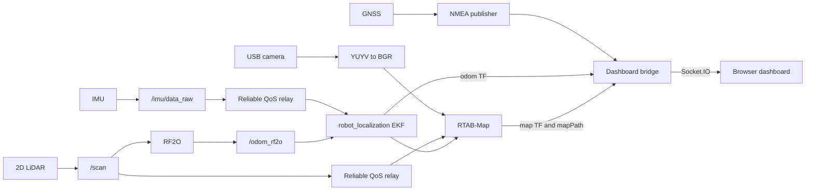

# Multi-Sensor Localisation on a Raspberry Pi Robot

A multi-sensor localisation system built on a Raspberry Pi 5 and a four-wheel mobile platform for a communication systems design course. It combines 2D LiDAR, an IMU, GNSS and a USB camera through ROS2, with a browser dashboard for indoor relative trajectories and outdoor map positioning.

I completed this project individually, from hardware assembly and sensor integration to configuration, debugging, testing and the web demonstration. Parts of the code were supplied by hardware manufacturers, and parts were developed with AI assistance. I integrated these components and tested the complete system on the robot. The localisation pipeline uses RF2O, `robot_localization` and RTAB-Map.

## What the system does

- Identifies serial-device candidates and starts the sensor and processing nodes through a common script.
- Uses RF2O laser odometry and IMU measurements with `robot_localization` for planar indoor motion estimation.
- Feeds scan, image and filtered odometry data to RTAB-Map for mapping/optimisation and visual loop-closure experiments.
- Publishes GNSS fixes and local east/north coordinates, and converts WGS84 coordinates to GCJ-02 for AMap display.
- Switches the dashboard between indoor trajectory rendering and outdoor map display.
- Controls the differential-drive platform through a gamepad and an I2C motor board.

## Results

The completed system runs on the robot and supports multi-sensor data acquisition, ROS2 topic publishing, indoor relative trajectory display, outdoor GNSS positioning and browser-based mode switching. The startup script brings up the sensor drivers, localisation nodes and dashboard together.

During indoor tests, LiDAR and IMU data produced relative motion trajectories displayed on the dashboard. During outdoor tests, the GNSS node published coordinates that the dashboard displayed as both raw WGS84 values and converted GCJ-02 map positions. Switching to outdoor mode disables the indoor trajectory canvas. The screenshots below are from my project report.

| Indoor relative trajectory | Outdoor GNSS display |
| --- | --- |
|  |  |

The recorded topic rates were approximately 9.1 Hz on `/scan_reliable`, 50 Hz on `/imu/data_reliable`, 8 Hz on `/odom_rf2o`, and 20 Hz on `/fix`. These are topic publication rates from the captured test intervals. Because both GGA and RMC sentences can trigger `/fix` messages, its rate should not be interpreted as the GNSS receiver's independent position-update rate.

See the [test screenshots](docs/EVIDENCE.md) and [hardware gallery](docs/HARDWARE.md) for more detail.

## Architecture

Indoor positioning uses local motion estimates, while outdoor positioning uses GNSS coordinates. The dashboard selects the appropriate source for each mode and recenters the indoor display after a mode reset. The sensor nodes continue running across display-mode changes.

## Hardware and software

| Component | Role |
| --- | --- |
| Raspberry Pi 5, 8 GB | Main computing platform |
| RPLIDAR A1 | 2D laser scans |
| Serial IMU | Acceleration, angular velocity and quaternion measurements |
| USB GNSS receiver | Outdoor position |
| USB monocular camera | Image input for visual processing |
| Four-wheel chassis, I2C motor board, gamepad | Mobile test platform and manual control |
| Expansion boards, antennas and batteries | Connectivity, mounting and power |

The system runs on Ubuntu with ROS2 Jazzy. The dashboard uses Flask and Flask-SocketIO. See the [installation and build instructions](docs/INSTALL.md) for environment setup.

## Source map

| Path | Purpose |
| --- | --- |
| `scripts/start_demo1.sh`, `scripts/stop_demo1.sh` | Main demo lifecycle |
| `scripts/hw_handshake.py` | Serial-port discovery heuristics |
| `LIO2D/ros2_ws/src/gnss_ros2/` | GNSS configuration and publishing |
| `LIO2D/ros2_ws/src/ybimu_ros2/` | IMU node used by the main demo |
| `LIO2D/ros2_ws/src/image_converter_cpp/` | Camera format conversion |
| `Indoor/ros2_ws/src/rf2o_laser_odometry/` | Included RF2O source |
| `Indoor/ekf.yaml` | Main demo EKF parameters |
| `LiDAR/ros2_ws/src/rplidar_ros/` | LiDAR driver used by the documented build |
| `display_bridge/bridge_server.py` | ROS2 subscriptions, transforms and web server |
| `Display/templates/`, `Display/static/` | Dashboard UI |
| `Car/` | Teleoperation and separate chassis diagnostics |

Other vendor packages, calibration utilities and alternative launch paths are retained. They are not all required by the main demo. In particular, `Indoor` has an alternative IMU package with the same name; the main-demo build selects only RF2O there to avoid overlaying the LIO2D IMU node.

## Running

Place the project at `~/rtls_project` on the target device, follow [INSTALL.md](docs/INSTALL.md), then configure your own AMap key as described in [RELEASE_SETUP.md](RELEASE_SETUP.md). No real key is included. The dashboard listens on port 5001.

The launch and stop scripts control motors/processes and remove the previous RTAB-Map database and run logs. Save any experiment data you want to retain before restarting or stopping the system.

## Limitations and future work

The project report identifies four main limitations from testing:

| Limitation | Observed behaviour | Possible improvement |
| --- | --- | --- |
| Indoor corridor geometry | Long corridors and repeated structures can cause weak translation estimates and heading drift. | Evaluate a better IMU and carefully assess horizontal acceleration constraints. |
| GNSS reception | Trees, nearby buildings and antenna placement can cause drift, delayed updates and underestimated displacement. | Evaluate RTK GNSS with a suitable external antenna. |
| Monocular vision | Limited depth information, low texture, lighting changes and rapid motion restrict the camera's contribution. | Investigate a depth or stereo camera for stronger visual constraints. |
| Device discovery time | Probing serial ports and inspecting data streams adds startup delay. | Use stable device identifiers or serial numbers where supported. |

RTAB-Map provides trajectory optimisation and visual assistance in the indoor pipeline. Improving robustness and evaluating these proposed hardware changes are directions for further work.

## Code sources and acknowledgements

This repository includes hardware-manufacturer code, third-party open-source components and code developed with AI assistance. My work covers the physical assembly, integration of the sensing and localisation pipeline, configuration, debugging, testing and dashboard demonstration.

Thanks to the developers of RF2O, RTAB-Map, `robot_localization`, the Slamtec RPLIDAR driver and the hardware libraries used in this system. Their existing author notices and licence files are retained. See [THIRD_PARTY.md](THIRD_PARTY.md) for the component inventory.
