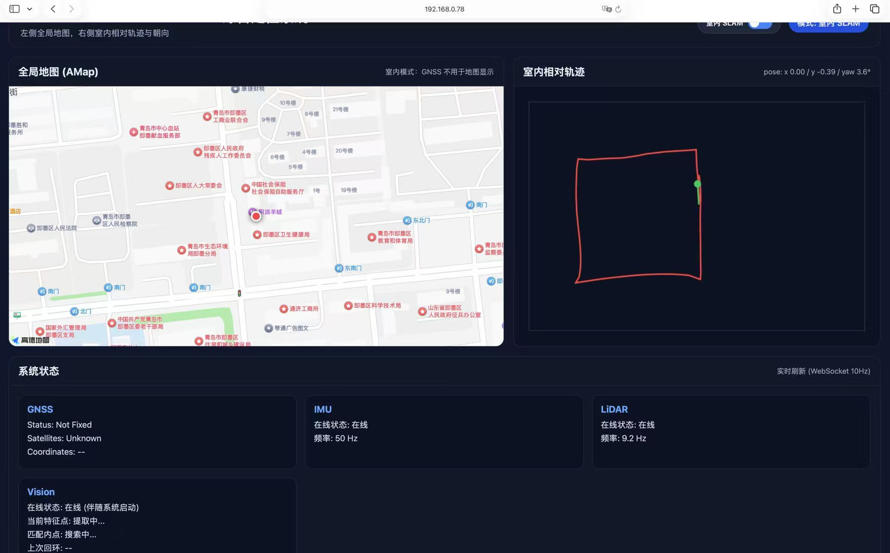
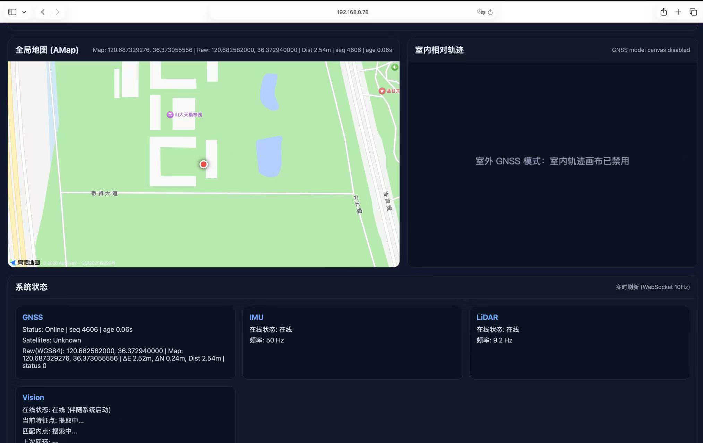
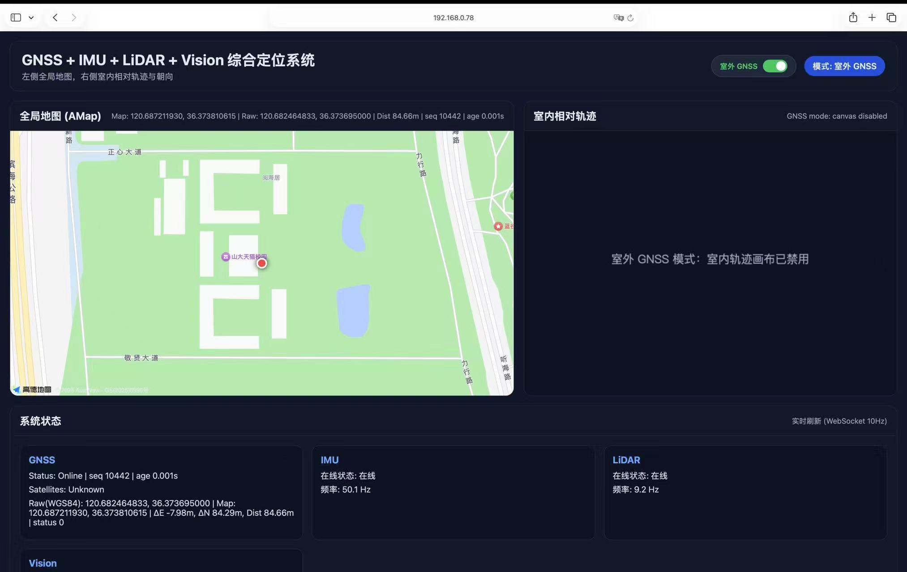
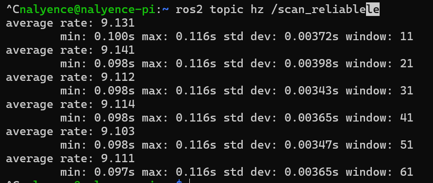
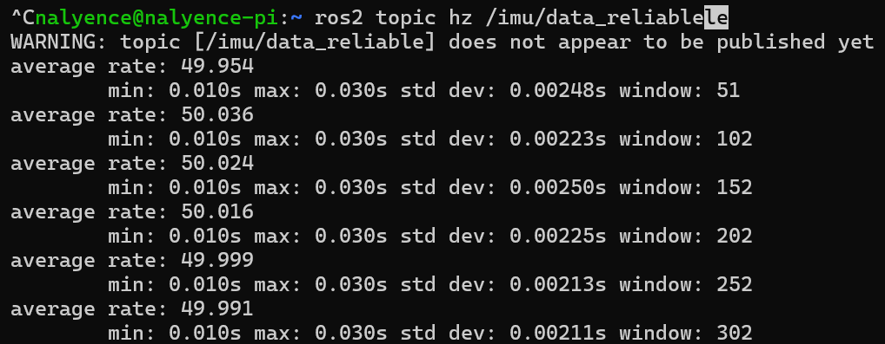
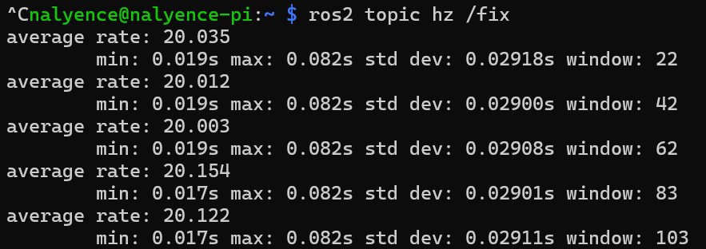
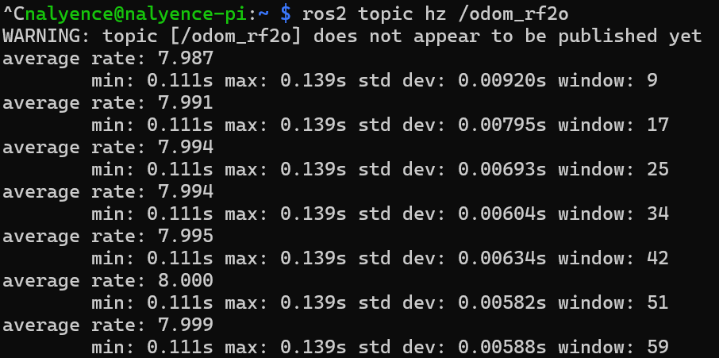

# Demonstration evidence

All captures on this page were extracted directly from the owner's earlier `RTLS.docx` report. They retain their original Chinese UI, terminal text and map attribution. No screenshots were generated by running the release copy. The capture date and exact source commit are not established.

## Indoor and outdoor dashboard

An indoor example showing a roughly rectangular relative trajectory, with reported IMU and LiDAR activity. The map panel is not an indoor global-position estimate. This picture alone does not prove measured path accuracy or a successful visual loop closure.

An outdoor example showing the WGS84 fix, converted map coordinates and disabled indoor canvas. The displayed `Dist` is displacement from the browser's GNSS reference, not positioning error.

A second outdoor capture shows a different displayed position. It is not paired with a surveyed ground-truth point. The small `age` value measures freshness relative to the bridge timestamp, not the complete sensor-to-screen delay.

[Initial indoor dashboard](images/indoor-idle.png) is also retained. Vision online labels and feature/match counts in the source include fixed strings and must not be treated as independent sensor-quality measurements.

## Recorded topic rates

The ranges below summarize the visible **average rate** lines in each screenshot, rounded for readability. They are short captured intervals, not repeated-trial confidence intervals or guaranteed operating specifications.

| Topic | Visible average rates | Capture |
| --- | --- | --- |
| `/scan_reliable` | approximately 9.10–9.14 Hz | [LiDAR](images/lidar-rate.png) |
| `/imu/data_reliable` | approximately 49.95–50.04 Hz | [IMU](images/imu-rate.png) |
| `/fix` | approximately 20.00–20.15 Hz | [GNSS](images/gnss-rate.png) |
| `/odom_rf2o` | approximately 7.99–8.00 Hz | [RF2O](images/rf2o-rate.png) |

The IMU and RF2O captures include an initial topic-not-published warning followed by rate measurements. These messages are preserved. The GNSS publisher processes both GGA and RMC sentences, each of which can produce a `/fix` message. This is a plausible explanation for a roughly 20 Hz topic rate with a requested 10 Hz receiver configuration, but the screenshot does not independently verify that receiver setting.

View the four rate captures

## Startup and ROS output

| Capture | What it records | What it does not establish |
| --- | --- | --- |
| [Startup](images/startup.png) | Port classification and launch-script progress messages | Health of every launched process |
| [Topic list](images/topics.png) | Discovered topic names in the earlier run | Accuracy or sustained throughput |
| [EKF output](images/ekf-output.png) | Part of an odometry message in `odom`, with child `base_link` | Agreement with ground truth |
| [RTAB-Map path](images/rtabmap-path.png) | Part of a `/mapPath` message in `map` | A demonstrated loop-closure correction |

The original source filenames and image hashes are recorded in [image_sources.json](image_sources.json). Hardware photographs are presented in [HARDWARE.md](HARDWARE.md), and the release's remaining tests are listed in [VALIDATION.md](VALIDATION.md).
