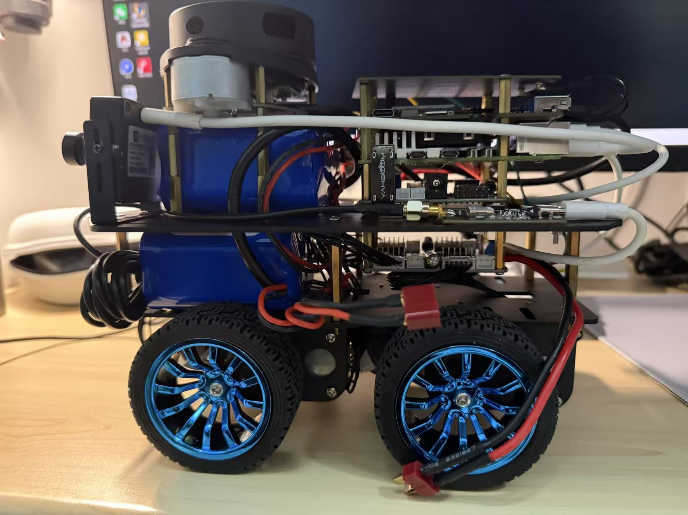
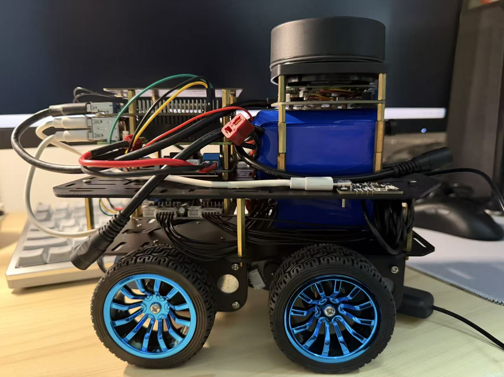
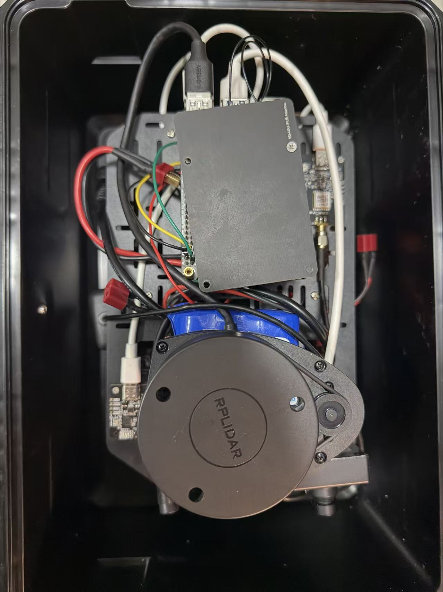
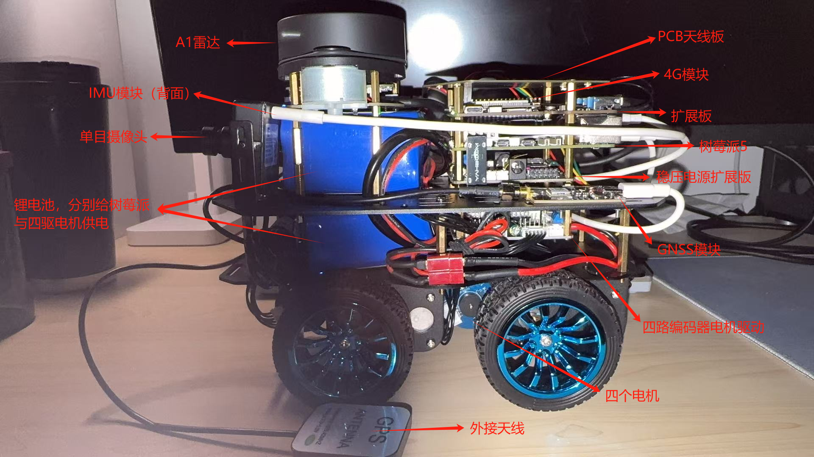

# Hardware assembly

I assembled the robot on a four-wheel chassis, with stacked computing boards, separate batteries and a raised LiDAR mount. The photographs below show the sensors, electronics and wiring used in the project.

## Camera side

## LiDAR side

## Top view

## Annotated assembly from the report

The original Chinese labels identify the A1 LiDAR, IMU on the reverse side, monocular camera, batteries, antenna board, 4G module, expansion board, Raspberry Pi 5, regulated power board, GNSS module, four-channel motor driver, motors and external antenna. Separate batteries power the computing platform and motors.

The annotated image comes from my project report. See [image_sources.json](image_sources.json) for the image sources and SHA-256 hashes.
